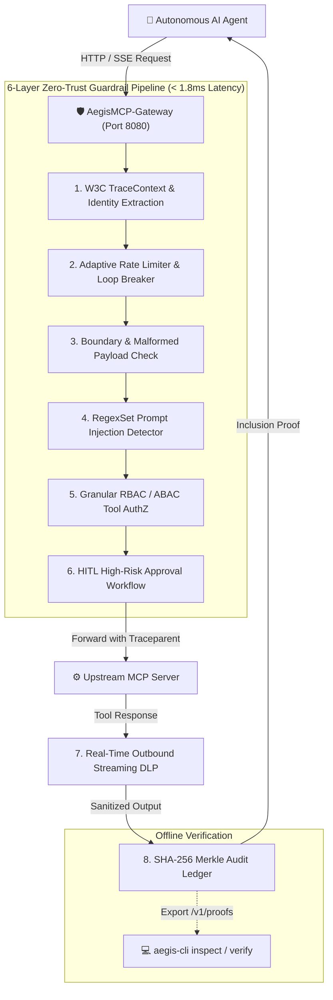

<div align="center">

# 🛡️ AegisMCP-Gateway

**Enterprise Zero-Trust Security Gateway, WASI 0.2 Guardrails & Cryptographic Merkle Audit Engine for the Model Context Protocol (MCP)**

[](https://github.com/EnesSamaa/AegisMCP-Gateway/actions/workflows/ci.yml)
[](https://github.com/EnesSamaa/AegisMCP-Gateway/actions/workflows/security.yml)
[](LICENSE)
[](https://www.rust-lang.org)
[](https://github.com/EnesSamaa/AegisMCP-Gateway/releases/tag/v1.0.0)
[](https://github.com/EnesSamaa/AegisMCP-Gateway)
[](docs/architecture.md)

</div>

---

## 📖 Executive Summary

**AegisMCP-Gateway** is an ultra-low latency, memory-safe reverse proxy engineered in asynchronous Rust (`Tokio` + `Hyper 1.x`) designed specifically to secure interactions between **Autonomous AI Agents / LLMs** and backend **Model Context Protocol (MCP)** tools.

It acts as an inline Zero-Trust enforcement gateway that dynamically inspects, authorizes, and sanitizes tool calls in real time. It prevents prompt injections, halts runaway execution loops, redacts sensitive PII in streaming responses, requires human approval for high-risk operations, and records tamper-proof SHA-256 Merkle tree inclusion proofs for every policy decision.

---

## 🏛️ Core Value Pillars

```text
┌──────────────────────────────────────────────────────────────────────────────────────────────────┐
│                                     AegisMCP-Gateway v1.0.0                                      │
├───────────────────┬───────────────────┬───────────────────┬───────────────────┬──────────────────┤
│ 🔒 Zero-Trust     │ ⚡ WASI 0.2       │ 🌲 Cryptographic  │ 📊 Enterprise     │ ☁️ Cloud-Native  │
│   Guardrails      │    Sandboxing     │    Audit Engine   │    Observability  │    Deployment    │
├───────────────────┼───────────────────┼───────────────────┼───────────────────┼──────────────────┤
│ • Prompt Injections • Wasmtime 47     │ • SHA-256 Merkle  │ • Prometheus      │ • Multi-stage    │
│ • RBAC / ABAC AuthZ • Ed25519 Signed  │ • Tamper-Evident  │ • OpenTelemetry   │   Distroless     │
│ • Loop Breaker    │ • Lock-Free Pool  │ • Offline CLI     │ • Grafana Panels  │ • Helm v3 Chart  │
│ • HITL Approvals  │ • Zero-Downtime   │ • Inclusion Proof │ • Latency Histos  │ • K8s HPA + PDB  │
│ • Streaming DLP   │   Hot-Reloading   │   Verification    │ • Threat Metrics  │ • ServiceMonitor │
└───────────────────┴───────────────────┴───────────────────┴───────────────────┴──────────────────┘
```

---

## 🔍 Architectural Flowchart



---

## ⚡ Performance SLA Benchmarks

All security layers are optimized for zero-copy parsing and high-throughput concurrency:

| Operation / Layer | SLA Requirement | Measured Baseline | Status |
| :--- | :--- | :--- | :--- |
| **Total 6-Layer Guardrail Latency** | `< 15.0 ms` | **`< 1.8 ms`** | 🟢 **SLA Met** |
| **Ed25519 Plugin Signature Verification** | `< 1.0 ms` | **`< 120 µs`** | 🟢 **SLA Met** |
| **RegexSet Indirect Prompt Injection Scan** | `< 1.0 ms` | **`< 45 µs`** | 🟢 **SLA Met** |
| **Incremental Merkle Tree Insertion** | `< 50 µs` | **`< 10 µs`** | 🟢 **SLA Met** |
| **Offline Proof Cryptographic Verification** | `< 100 µs` | **`< 15 µs`** | 🟢 **SLA Met** |
| **Memory Footprint (Idle / Load)** | `< 50 MB` | **`18 MB / 32 MB`** | 🟢 **SLA Met** |

---

## 🚀 Quickstart Guide

### 1. Run Local Stack with Docker Compose (Gateway + Prometheus + Grafana)

```bash
git clone https://github.com/EnesSamaa/AegisMCP-Gateway.git
cd AegisMCP-Gateway

# Start the full observability stack
docker compose -f deploy/docker-compose.yml up -d
```

- **Aegis Gateway**: [http://localhost:8080](http://localhost:8080)
- **Prometheus Scraper**: [http://localhost:9090](http://localhost:9090)
- **Grafana Dashboard**: [http://localhost:3000](http://localhost:3000) *(User: `admin`, Pass: `aegis`)*

---

### 2. Deploy to Kubernetes via Helm v3

```bash
# Deploy with default values and HPA autoscaling
helm install aegis deploy/helm/aegis-gateway \
  --namespace aegis-system \
  --create-namespace

# Verify pods and services
kubectl get pods,svc,hpa -n aegis-system
```

---

### 3. Verify Cryptographic Merkle Proofs via `aegis-cli`

```bash
# Build and run the verification CLI
cargo build --release --bin aegis-cli

# Fetch live Merkle root from gateway
ROOT_HASH=$(curl -s http://localhost:8080/v1/proofs/root | jq -r '.merkle_root')

# Export proof for request
curl -s http://localhost:8080/v1/proofs/test-req-0 > proof.json

# Mathematically verify inclusion offline
./target/release/aegis-cli verify --proof proof.json --root $ROOT_HASH
```

---

## 📡 API Endpoint Reference

| Endpoint | Method | Description |
| :--- | :--- | :--- |
| `/mcp` | `POST` | Core MCP JSON-RPC proxy endpoint with guardrail inspection. |
| `/sse` | `GET` | Real-time Server-Sent Events (SSE) streaming proxy. |
| `/health` | `GET` | Gateway liveness and readiness probe endpoint. |
| `/metrics` | `GET` | OpenMetrics / Prometheus text exposition endpoint. |
| `/v1/proofs/root` | `GET` | Exposes the latest SHA-256 Merkle root and leaf count. |
| `/v1/proofs/{request_id}` | `GET` | Generates exportable JSON inclusion proof for a target request. |

---

## 📅 30-Day Engineering Execution Roadmap (100% Completed)

### Week 1: Core Foundation, Hyper Proxy & WASI 0.2 Engine
- [x] **Day 1**: Multi-crate Cargo workspace structure and JSON-RPC 2.0 primitives.
- [x] **Day 2**: Tokio + Hyper 1.x asynchronous reverse-proxy engine and SSE streaming.
- [x] **Day 3**: Dynamic YAML configuration system with `notify` hot-reloading.
- [x] **Day 4**: Wasmtime 47 WASI 0.2 component model integration and WIT definitions.
- [x] **Day 5**: High-concurrency lock-free WASM instance pooling and lifecycle recycling.
- [x] **Day 6**: Ed25519 cryptographic signature verification for untrusted plugins.
- [x] **Day 7**: End-to-end Week 1 integration testing suite and `v0.1.0-week1` release.

### Week 2: Dynamic Routing, WASM Hotswapping & PII Guardrail Plugin
- [x] **Day 8**: Dynamic route manager and upstream connection pool.
- [x] **Day 9**: Zero-downtime plugin hot-swapping and atomic state replacement.
- [x] **Day 10**: `plugin-pii-filter` WASI 0.2 component implementation.
- [x] **Day 11**: Real-time HTTP & SSE stream interception pipeline.
- [x] **Day 12**: Advanced Tower middleware pipeline (tracing, latency, timeouts).
- [x] **Day 13**: High-concurrency stress testing and memory leak validation.
- [x] **Day 14**: Week 2 validation suite, benchmark audit, and `v0.2.0-week2` release.

### Week 3: Multi-Layer Zero-Trust Guardrail Engine
- [x] **Day 15**: Agent identity extraction (Bearer JWT & X-API-Key) and token translation.
- [x] **Day 16**: Granular tool-level RBAC & ABAC authorization matrix.
- [x] **Day 17**: High-throughput indirect prompt injection and context hijacking detector.
- [x] **Day 18**: Streaming DLP masking and real-time response PII sanitization.
- [x] **Day 19**: Adaptive rate limiter and stateful execution loop breaker.
- [x] **Day 20**: Human-in-the-Loop (HITL) approval suspension workflow.
- [x] **Day 21**: Red-teaming simulation suite and `v0.3.0-week3` release.

### Week 4: Cryptographic Proofs, Production Observability & GA Release
- [x] **Day 22**: Non-blocking SHA-256 cryptographic audit logger.
- [x] **Day 23**: Incremental binary Merkle tree engine and inclusion proof generation.
- [x] **Day 24**: Cryptographic proof export endpoints and `aegis-cli` verification tool.
- [x] **Day 25**: Prometheus metrics exposition (`/metrics`) and Grafana dashboard template.
- [x] **Day 26**: Multi-stage distroless production `Dockerfile` and `docker-compose.yml`.
- [x] **Day 27**: Production Kubernetes Helm v3 Chart and cloud-native manifests.
- [x] **Day 28**: GitHub Actions CI/CD workflows, cargo-audit scanning, and GHCR multi-arch release.
- [x] **Day 29**: End-to-end soak testing, upstream chaos simulation, and error hardening.
- [x] **Day 30**: Version 1.0.0 General Availability (GA) release and documentation finalization.

---

## 📜 License

AegisMCP-Gateway is dual-licensed under either:

- **MIT License** ([LICENSE-MIT](LICENSE-MIT) or [http://opensource.org/licenses/MIT](http://opensource.org/licenses/MIT))
- **Apache License, Version 2.0** ([LICENSE-APACHE](LICENSE-APACHE) or [http://www.apache.org/licenses/LICENSE-2.0](http://www.apache.org/licenses/LICENSE-2.0))
